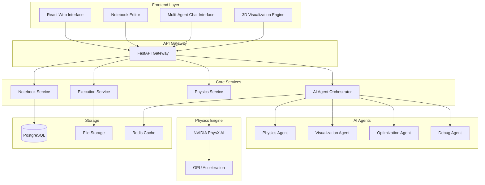

# Design Document

## Overview

The AI-powered engineering simulation platform is a web-based application that combines Jupyter notebook functionality with advanced physics simulation capabilities powered by NVIDIA PhysX AI. The platform features a multi-agent AI system that provides specialized assistance for different aspects of simulation development, from physics modeling to visualization and performance optimization.

The architecture follows a microservices pattern with a React-based frontend, Python backend services, and specialized AI agents that coordinate to provide comprehensive simulation support.

## Architecture

### High-Level Architecture



### Component Architecture

The system is built using a layered architecture with clear separation of concerns:

1. **Presentation Layer**: React-based web interface with specialized components for notebook editing, AI chat, and 3D visualization
2. **API Layer**: FastAPI gateway that handles routing, authentication, and request orchestration
3. **Business Logic Layer**: Core services for notebook management, code execution, and AI coordination
4. **Physics Engine Layer**: NVIDIA PhysX AI integration with GPU acceleration
5. **Data Layer**: PostgreSQL for structured data, file storage for notebooks, Redis for caching

## Components and Interfaces

### Frontend Components

#### Notebook Editor Component
- **Purpose**: Provides the main interface for creating and editing simulation notebooks
- **Key Features**:
  - Monaco Editor integration with Python syntax highlighting
  - Physics-aware code completion using AI suggestions
  - Inline output rendering for text, HTML, images, and 3D visualizations
  - Cell management with simulation-specific cell types
- **Interface**: Communicates with Notebook Service via WebSocket for real-time collaboration

#### Multi-Agent Chat Interface
- **Purpose**: Provides a dedicated interface for interacting with specialized AI agents
- **Key Features**:
  - Agent selection and routing based on query context
  - Conversation history with context preservation
  - Code insertion capabilities from chat to notebook
  - Real-time agent coordination display
- **Interface**: WebSocket connection to AI Agent Orchestrator

#### 3D Visualization Engine
- **Purpose**: Renders physics simulations and 3D visualizations inline
- **Key Features**:
  - Three.js-based 3D rendering
  - Interactive controls for simulation playback
  - Real-time physics visualization updates
  - Export capabilities for simulation results
- **Interface**: WebGL rendering with data from Physics Service

### Backend Services

#### Notebook Service
- **Purpose**: Manages notebook CRUD operations and metadata
- **Responsibilities**:
  - Notebook creation, editing, and persistence
  - Version control and collaboration features
  - Workbook organization and management
  - Template management for simulation types
- **Interface**: REST API with WebSocket support for real-time updates

#### Execution Service
- **Purpose**: Handles Python code execution with physics simulation support
- **Responsibilities**:
  - Secure Python code execution in isolated environments
  - NVIDIA PhysX AI library integration
  - Output capture and formatting
  - GPU resource management
- **Interface**: Async execution API with streaming results

#### AI Agent Orchestrator
- **Purpose**: Coordinates multiple AI agents and manages their interactions
- **Responsibilities**:
  - Agent selection based on query analysis
  - Context sharing between agents
  - Conflict resolution when agents provide different suggestions
  - Performance monitoring and load balancing
- **Interface**: Agent communication protocol with message queuing

#### Physics Service
- **Purpose**: Provides physics simulation capabilities using NVIDIA PhysX AI
- **Responsibilities**:
  - PhysX AI library wrapper and abstraction
  - GPU acceleration management
  - Physics parameter optimization
  - Simulation result processing
- **Interface**: High-performance computing API with GPU integration

### AI Agent Specifications

#### Physics Agent
- **Specialization**: NVIDIA PhysX AI expertise, physics modeling, simulation setup
- **Capabilities**:
  - Physics equation assistance
  - PhysX API guidance
  - Simulation parameter recommendations
  - Physics debugging and validation

#### Visualization Agent
- **Specialization**: 3D graphics, data visualization, simulation rendering
- **Capabilities**:
  - Visualization code generation
  - Rendering optimization suggestions
  - Interactive visualization setup
  - Animation and timeline management

#### Optimization Agent
- **Specialization**: Performance tuning, GPU utilization, algorithm optimization
- **Capabilities**:
  - Performance profiling analysis
  - GPU memory optimization
  - Parallel processing recommendations
  - Simulation speed improvements

#### Debug Agent
- **Specialization**: Error analysis, troubleshooting, code quality
- **Capabilities**:
  - Physics simulation debugging
  - Error pattern recognition
  - Code quality suggestions
  - Performance bottleneck identification

## Data Models

### Notebook Model
```python
class Notebook:
    id: UUID
    title: str
    description: str
    workbook_id: UUID
    cells: List[Cell]
    metadata: Dict[str, Any]
    created_at: datetime
    updated_at: datetime
    version: int
```

### Cell Model
```python
class Cell:
    id: UUID
    notebook_id: UUID
    cell_type: CellType  # CODE, MARKDOWN, PHYSICS, VISUALIZATION
    content: str
    outputs: List[CellOutput]
    execution_count: int
    metadata: Dict[str, Any]
    position: int
```

### Simulation Context Model
```python
class SimulationContext:
    id: UUID
    notebook_id: UUID
    physics_parameters: Dict[str, Any]
    gpu_resources: GPUResourceConfig
    active_agents: List[str]
    execution_state: ExecutionState
```

### Agent Interaction Model
```python
class AgentInteraction:
    id: UUID
    session_id: UUID
    agent_type: AgentType
    query: str
    response: str
    context: Dict[str, Any]
    confidence_score: float
    timestamp: datetime
```

## Error Handling

### Physics Engine Errors
- **PhysX Initialization Failures**: Graceful fallback to software physics with user notification
- **GPU Memory Exhaustion**: Automatic memory management with simulation parameter adjustment
- **Simulation Convergence Issues**: AI-powered parameter tuning suggestions

### AI Agent Errors
- **Agent Unavailability**: Automatic failover to backup agents or single-agent mode
- **Context Loss**: Session recovery mechanisms with conversation history restoration
- **Conflicting Suggestions**: Transparent presentation of options with trade-off explanations

### Execution Errors
- **Code Execution Failures**: Physics-aware error analysis with debugging suggestions
- **Resource Limitations**: Dynamic resource allocation with priority-based queuing
- **Network Connectivity**: Offline mode with local execution capabilities

## Testing Strategy

### Unit Testing
- **Frontend Components**: Jest and React Testing Library for UI components
- **Backend Services**: pytest for Python services with mock physics engine
- **AI Agents**: Isolated testing with predefined query-response pairs

### Integration Testing
- **API Integration**: End-to-end API testing with real physics simulations
- **Agent Coordination**: Multi-agent interaction testing with complex scenarios
- **Physics Engine**: NVIDIA PhysX AI integration testing with GPU validation

### Performance Testing
- **Simulation Performance**: Benchmarking with various physics complexity levels
- **GPU Utilization**: Memory and compute efficiency testing
- **Concurrent Users**: Load testing with multiple simultaneous simulations

### User Acceptance Testing
- **Simulation Workflows**: End-to-end testing of common engineering simulation tasks
- **AI Assistance Quality**: Evaluation of agent suggestions and accuracy
- **Visualization Rendering**: Cross-browser testing of 3D visualization performance